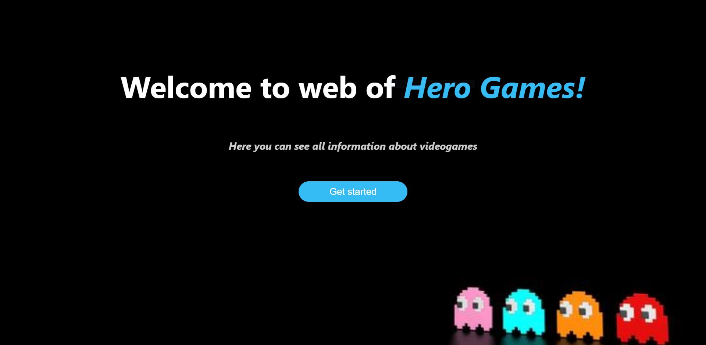
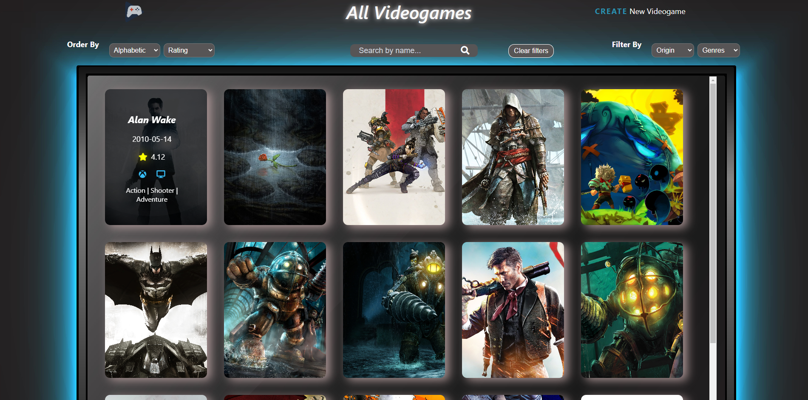
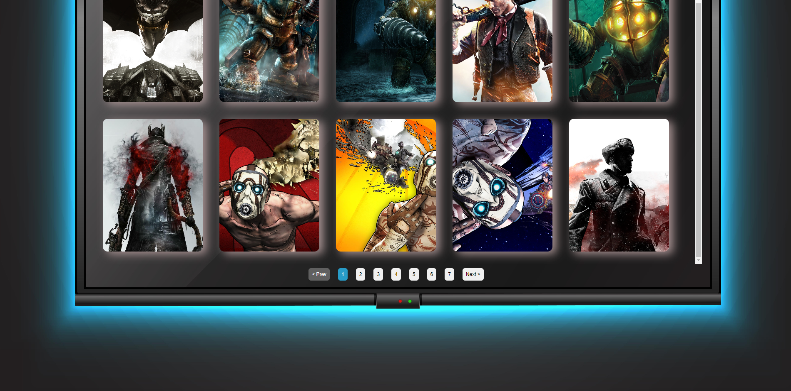
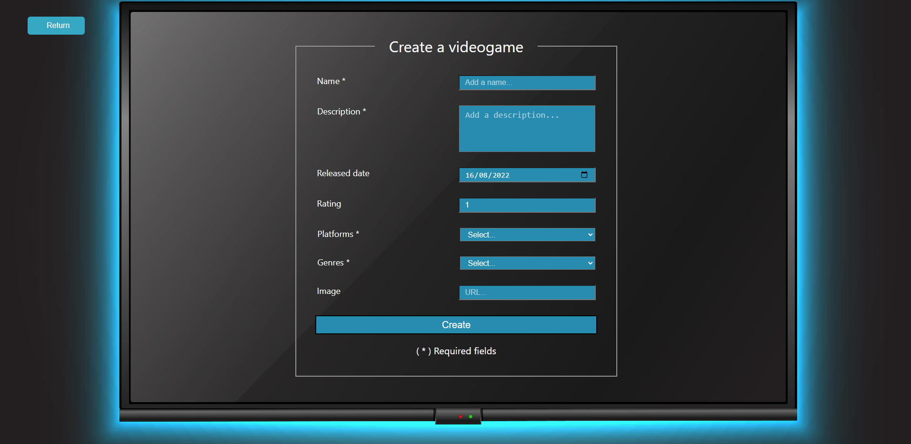

<h1>Hola 👋 a todos!</h1>

Soy Lisandro Landaburu, desarrollador web Full Stack con orientación al Back-end. Me considero una persona responsable, comprometida, con capacidad para trabajar en equipo, y alguien que no teme afrontar nuevos desafios.

<h2>Mis tecnologías:</h2>

          

<h2>Conoce sobre mis proyectos:</h2>
<h3 align="center">Videogames APP</h3>

Aplicación SPA realizada como proyecto individual para el bootcamp Soy Henry. En ella se va a poder ver información acerca de ciertos videojuegos, además de poder filtrar por género, ordenarlos alfabeticamente y por rating, también cuenta con un paginado. Y tiene la posibilidad de poder crear un nuevo videojuego, con un formulario controlado. Creada usando JavaScript, Express, React, Redux, CSS puro, PostgreSQL y Sequelize.

<h3 align="center">Salva mi huella</h3>

Proyecto final en grupo para el bootcamp Soy Henry. Esta aplicación se creo con el objetivo de fomentar la adopción de aquellos animales que se encuentra en situación de tránsito, además de darle mas visibilidad a las fundaciones que se dedican a ello. En este proyecto aprendi a trabajar en equipo, haciendo uso de la metodología SCRUM para la división de tareas. Me enfoque ampliamente al back-end, también me involucre en la implementacíon del login usando Auth0, además de siempre estar a disposición para ayudar a mis compañeros.
